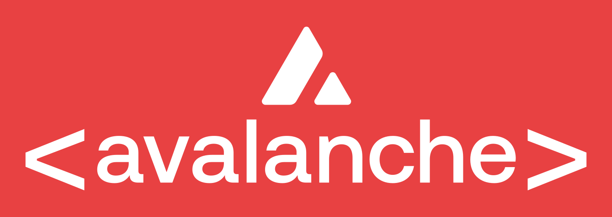

<p align="center">
  
</p>

<h1 align="center">avalanche-mcp-server</h1>

An MCP (Model Context Protocol) server that turns any AI agent or IDE (Claude Code, Claude Desktop, Cursor, Windsurf…) into an **Avalanche development guide**: searchable official docs, live C-Chain / P-Chain / X-Chain / Data API access, and opinionated workflows for launching L1s, configuring precompiles, and building ICM/Teleporter cross-chain apps.

## What's inside

| Layer | Tools / resources |
|---|---|
| **Knowledge** (offline, bundled index — ~9.9k chunks — of build.avax.network docs, Academy, 234 integrations, blog, all 36 ACPs, AvalancheGo/Subnet-EVM, ICM services, Avalanche CLI, starter kit) | `avax_search_docs`, `avax_get_doc`, `avax_list_docs`, `avax_list_topics`, `avax_get_guide`, `avax_search_integrations`, `avax://docs/{path}`, `avax://guides/{name}` |
| **ACPs & ecosystem** | `avax_acp_list`, `avax_acp_lookup` (structured status/track/authors, offline), `avax_acp_votes` (live `info.acps` signaling), `avax_console_flows` (Builder Console deep links + platform-cli commands), `avax_fetch_live_doc` (always-current `.md` endpoint) |
| **Hosted MCP federation** | `avax_hosted_list_tools`, `avax_hosted_call`, `avax_hosted_read_index` — proxy to Ava Labs' official MCP (`https://build.avax.network/api/mcp`) for `build_plan` runbooks, `cli_lookup_command`, `rpc_lookup_method`, always-fresh `docs_search`; 60 req/min, automatic actionable 429 errors |
| **Workflows** | `avax_plan_l1_launch`, `avax_generate_genesis`, `avax_explain_precompile`, `avax_icm_recipe`, `avax_troubleshoot` |
| **Live EVM** (C-Chain, Fuji, known L1s, any RPC URL) | `avax_list_networks`, `avax_get_chain_status`, `avax_get_balance`, `avax_get_block`, `avax_get_transaction`, `avax_get_code`, `avax_call_contract`, `avax_estimate_gas` |
| **P-Chain / X-Chain / info** | `avax_pchain_get_validators`, `avax_pchain_get_subnet`, `avax_pchain_list_blockchains`, `avax_pchain_get_stake_info`, `avax_pchain_get_tx_status`, `avax_pchain_get_balance`, `avax_xchain_get_balance`, `avax_node_info` |
| **Avalanche Data API (Glacier)** | `avax_data_list_chains`, `avax_data_list_erc20_balances`, `avax_data_list_transactions`, `avax_data_get_token_metadata`, `avax_data_list_l1_validators` |
| **Prompts** | `avalanche_launch_l1`, `avalanche_deploy_contract`, `avalanche_icm_bridge`, `avalanche_learn` |

All tools are **read-only**. Nothing signs or broadcasts transactions.

## Quick start

Installed exactly like Ava Labs' hosted MCP — a public Streamable HTTP endpoint, no key, no install:

```bash
claude mcp add avalanche --transport http https://avalanche-mcp.dev/mcp
```

| Client | How |
|---|---|
| **Claude Code** | command above, or in `.mcp.json`: `{ "mcpServers": { "avalanche": { "type": "http", "url": "https://avalanche-mcp.dev/mcp" } } }` |
| **Claude Desktop** | stdio bridge: `{ "command": "npx", "args": ["-y", "mcp-remote", "https://avalanche-mcp.dev/mcp"] }` in `claude_desktop_config.json` |
| **Cursor / Windsurf** | `{ "mcpServers": { "avalanche": { "url": "https://avalanche-mcp.dev/mcp" } } }` |
| **Local / offline** | `claude mcp add avalanche -- npx -y avalanche-mcp-server` (after npm publish) or from source below |
| **Anything** | plain JSON-RPC: `curl -X POST https://avalanche-mcp.dev/mcp -H 'content-type: application/json' -d '{"jsonrpc":"2.0","id":1,"method":"tools/list"}'` |

### From source

```bash
git clone https://github.com/Eelvanpsd/Avalanche-mcp.git && cd Avalanche-mcp
npm install && npm run build          # index ships in the repo; `npm run build-index` refreshes it
claude mcp add avalanche -- node "$PWD/dist/index.js"
npm run inspect                       # MCP Inspector UI
```

### Self-host the HTTP endpoint

```bash
PORT=3333 node dist/index.js --http   # POST http://localhost:3333/mcp (stateless JSON, CORS open)
```

Or mount it in any web-standard runtime (Next.js route handler, Workers, Hono):

```ts
import { handleMcpRequest } from "avalanche-mcp-server";
export const POST = (req: Request) => handleMcpRequest(req);
```

This is how avalanche-mcp.dev serves it ([avalanche-mcp-web](https://github.com/Eelvanpsd/avalanche-mcp-web)).

## Environment

| Var | Purpose |
|---|---|
| `GLACIER_API_KEY` | Optional. Higher rate limits for `avax_data_*` tools. Free key at https://build.avax.network |
| `GLACIER_BASE_URL` | Override Data API base (default `https://glacier-api.avax.network/v1`) |
| `AVAX_HOSTED_MCP_URL` | Override the hosted Avalanche MCP endpoint (default `https://build.avax.network/api/mcp`) |

## Works alongside the official Avalanche MCPs

This server is **offline-first and workflow-rich**; Ava Labs' hosted MCP is always-current and covers Builder Hub search, CLI/RPC lookup and runbooks. Use both:

```bash
claude mcp add avalanche -- node /ABSOLUTE/PATH/avalanche-dev-mcp/dist/index.js
claude mcp add avalanche-hosted --transport http https://build.avax.network/api/mcp
claude mcp add avalanche-chainkit -- npx -y @avalanche-sdk/chainkit mcp-server
claude mcp add avalanche-avacloud -- npx -y @avalabs/avacloud-sdk mcp-server --apikey $AVACLOUD_API_KEY
```

`avax_hosted_call` already proxies the hosted server from inside this one, so a single registration is enough for most setups.

## Keeping docs fresh

`npm run build-index` pulls tarballs from:
- `ava-labs/builders-hub` (`content/docs`, `content/academy/{avalanche-l1,blockchain}`, `content/integrations`, `content/blog`)
- `avalanche-foundation/ACPs` (every ACP README, parsed into structured metadata)
- `ava-labs/avalanchego` (README, `docs/`, `graft/subnet-evm` READMEs & precompile docs)
- `ava-labs/icm-services`, `ava-labs/avalanche-cli`, `ava-labs/avalanche-starter-kit`

Use `REFRESH=1 npm run build-index` to re-download. A weekly CI job that rebuilds and republishes is recommended — stale docs are the main risk for an agent guide.

## Adding knowledge
- Curated guides: `src/knowledge/guides.ts` (architecture, launch-l1, precompiles, icm, gas-and-fees, troubleshooting).
- Network registry (chain IDs, RPCs, L1s): `src/config/networks.ts`.
- New sources: add to `SOURCES` in `scripts/build-index.ts`.

## Development
```bash
npm run dev            # tsx src/index.ts (stdio)
npx tsx scripts/smoke.ts   # end-to-end check of tools over stdio
npm run typecheck
```

## License
MIT
